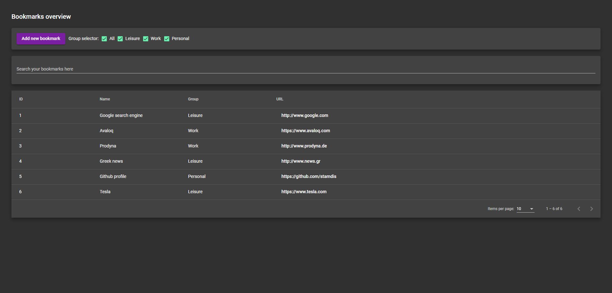
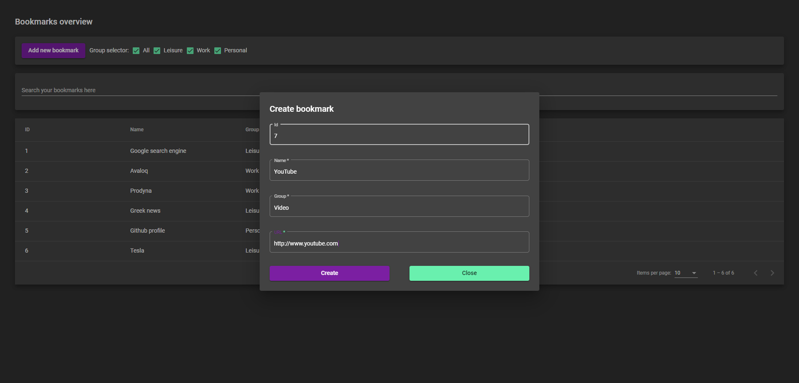

# Bookmarks

## Project description

### Summary

This repository contains an example monorepo project created with [Nx suite](https://nx.dev/) and [Angular](https://angular.io/). The main project consists of a simple application that manages bookmarks.

### Libraries & frameworks

- [Angular 11](https://angular.io/) as the main development framework.
- [Angular Material 11.2](https://material.angular.io/) for the user interface.
- [Angular Flex-Layout 11](https://github.com/angular/flex-layout) for the layout features (easy appliance of Flexbox CSS).
- [Ngrx 10](https://ngrx.io/) for managing the application state in a reactive manner.
- [Nx extensive dev tools 11.2](https://nx.dev/) for scaffolding the application, generation & management of Angular modules & components.

## Application features & screenshots

The following features are available in the application:

- Overview of bookmarks in a sortable & paginated table.
- Ability to configure number of items per table page.
- Filter bookmarks based on the group property.
- Full text search on the bookmarks collection.
- Navigation to the bookmark URL by clicking on the link.
- View the details of a bookmark by clicking on its table row.
- Delete a bookmark through the bookmark details dialog.
- Add a new bookmark through a validated dialog form.

Some example screenshots are provided below.

### Overview

### Add a bookmark

### Bookmark details

## Instructions

Before proceeding to the next sections, make sure you have installed [Node.js LTS](https://nodejs.org/en/).

### Run the application

To run the application follow the steps mentioned below:

1. Clone the repository.
2. Navigate to the project folder through a terminal.
3. Execute `npm install` to install the project dependencies.
4. Execute `nx serve bookmarks`.
5. Navigate through your browser to `http://localhost:4200/`.

### Run the tests

To run the Jest unit tests follow the steps mentioned below:

1. Clone the repository.
2. Navigate to the project folder through a terminal.
3. Execute `nx run-many --target=test --all` to execute the tests.

## Misc

For misc information feel free to refer to the [Nx generated README](./README_nx.md).
